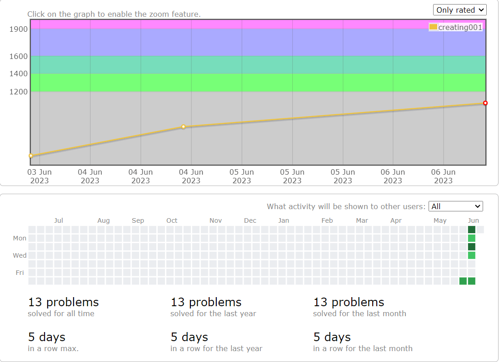

# codeforces
| rating           | color | title                     |
| :--------------- | :---- | :------------------------ |
| rating<1200      | 灰名  | newbie                    |
| 1200≤rating<1400 | 绿名  | pupil                     |
| 1400≤rating<1600 | 青名  | specialist                |
| 1600≤rating<1900 | 蓝名  | expert                    |
| 1900≤rating<2100 | 紫名  | candidate master          |
| 2100≤rating<2300 | 橙名  | master                    |
| 2300≤rating<2400 | 橙名  | international master      |
| 2400≤rating<2600 | 红名  | grandmaster               |
| 2600≤rating<3000 | 红名  | international grandmaster |
| 3000≤rating      | 黑红  | legendary grandmaster     |

## 2023-06-06

